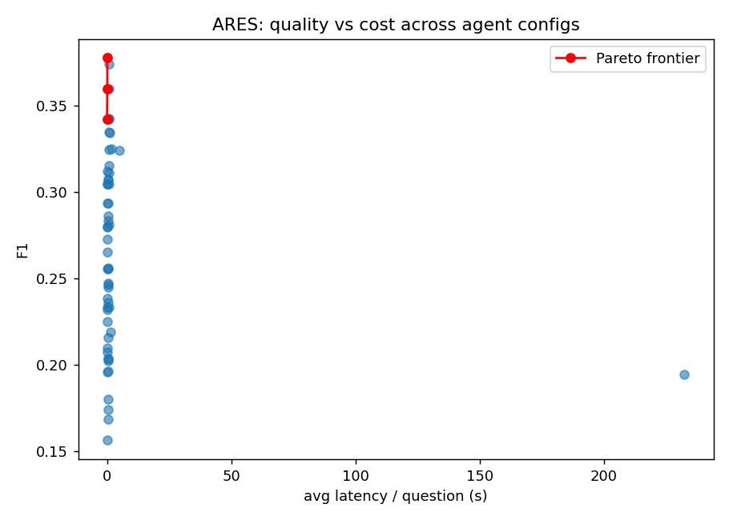
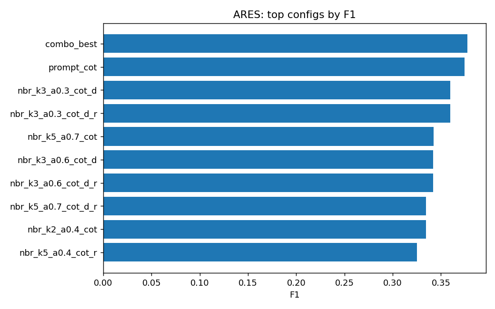

# ARES — Findings

Searched **55 agentic-RAG configurations** on a HotpotQA-style multi-hop QA set, fully local on Apple Silicon (MPS). Each config varies retrieval depth, dense/BM25 hybrid weight, prompt style, query decomposition, and self-reflection.

## Best configuration
**combo_best** — F1 **0.378** (**+28.7%** vs baseline F1 0.293), EM 0.300, retrieval recall 0.790, groundedness 0.834, avg latency 0.12s/question.

`retrieval_k=4.0  hybrid_alpha=0.5  prompt=cot  decompose=False  reflect=True`

## Top 10 configs
| config | F1 | EM | retrieval recall | groundedness | latency (s) |
|---|---|---|---|---|---|
| combo_best | 0.378 | 0.300 | 0.790 | 0.834 | 0.12 |
| prompt_cot | 0.374 | 0.300 | 0.790 | 0.816 | 0.93 |
| nbr_k3_a0.3_cot_d | 0.360 | 0.220 | 0.640 | 0.811 | 0.81 |
| nbr_k3_a0.3_cot_d_r | 0.360 | 0.220 | 0.640 | 0.811 | 0.11 |
| nbr_k5_a0.7_cot | 0.343 | 0.260 | 0.790 | 0.755 | 0.71 |
| nbr_k3_a0.6_cot_d | 0.342 | 0.200 | 0.670 | 0.795 | 0.00 |
| nbr_k3_a0.6_cot_d_r | 0.342 | 0.200 | 0.680 | 0.796 | 0.63 |
| nbr_k5_a0.7_cot_d_r | 0.335 | 0.220 | 0.810 | 0.753 | 0.93 |
| nbr_k2_a0.4_cot | 0.334 | 0.200 | 0.600 | 0.784 | 0.96 |
| nbr_k5_a0.4_cot_r | 0.325 | 0.220 | 0.800 | 0.829 | 1.79 |

## Quality vs cost (Pareto frontier)
These configs are not dominated — each is the cheapest way to reach its F1:

- **nbr_k3_a0.6_cot_d**: F1 0.342 @ 0.00s
- **nbr_k3_a0.3_cot_d_r**: F1 0.360 @ 0.11s
- **combo_best**: F1 0.378 @ 0.12s

## Plots

## Takeaways
- Query decomposition hurt (-0.012 F1 vs baseline) at 0.73s/q (1.6x baseline latency).
- Self-reflection was ~neutral (+0.000 F1 vs baseline) at 0.22s/q (0.5x baseline latency).
- Best hybrid weight was around `alpha=0.5` (1.0 = pure dense, 0.0 = pure BM25).
- Winner **combo_best** gives the best F1; the Pareto frontier shows the cheaper configs to use under a latency budget.

_Generated by ARES (Agentic RAG Evaluation Suite)._